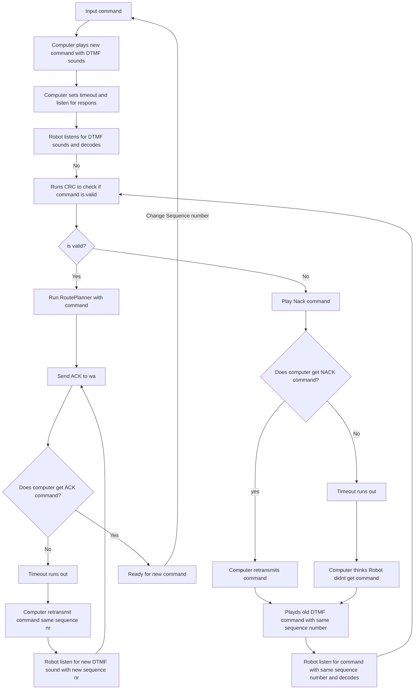

```mermaid
flowchart TD
    A[Input command] --> B[Computer plays new command with DTMF sounds]
    B --> C[Computer sets timeout and listen for respons]

    C --> D[Robot listens for DTMF sounds and decodes]
    D --> |No| E[Runs CRC to check if command is valid]
    E --> F{is valid?}
    F --> |Yes| G[Run RoutePlanner with command]
    G --> H[Send ACK to wa]
    F --> |No| I[Play Nack command]
    I --> J{Does computer get NACK command?}
    J --> |yes| K[Computer retransmits command]
    K --> L
    
    J --> |No| M[Timeout runs out]
    M --> N[Computer thinks Robot didnt get command]


    O --> |Change Sequence number| A
    H --> P{Does computer get ACK command?}
    P --> |Yes| O[Ready for new command]
    N --> L[Playds old DTMF command with same sequence number]
    L --> Q[Robot listen for command with same sequence number and decodes]
    Q --> E

    P --> |No| R[Timeout runs out]
    R --> S[Computer retransmit command same sequence nr]
    S --> T[Robot listen for new DTMF sound with new sequence nr]
    T --> H

```