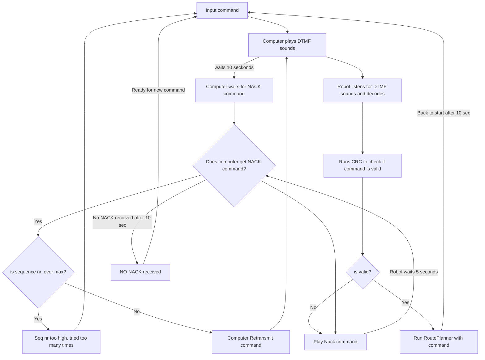

```mermaid
flowchart TD
    A[Input command] --> B[Computer plays DTMF sounds]
    B --> |waits 10 seckonds |C[Computer waits for NACK command]
    B --> D[Robot listens for DTMF sounds and decodes]
    D --> E[Runs CRC to check if command is valid]
    E --> F{is valid?}
    F -->|Yes| G[Run RoutePlanner with command]
    G --> |Back to start after 10 sec| A
    F -->|No| H[Play Nack command]
    H --> |Robot waits 5 seconds| L{Does computer get NACK command?}
    C --> L
    L --> |Yes| K{is sequence nr. over max?}
    K --> |Yes| N[Seq nr too high, tried too many times]
    N --> A
    K --> |No| M[Computer Retransmit command]
    M --> B
    J --> |Ready for new command| A
    L --> H
    L --> |No NACK recieved after 10 sec| J[NO NACK received]      
```