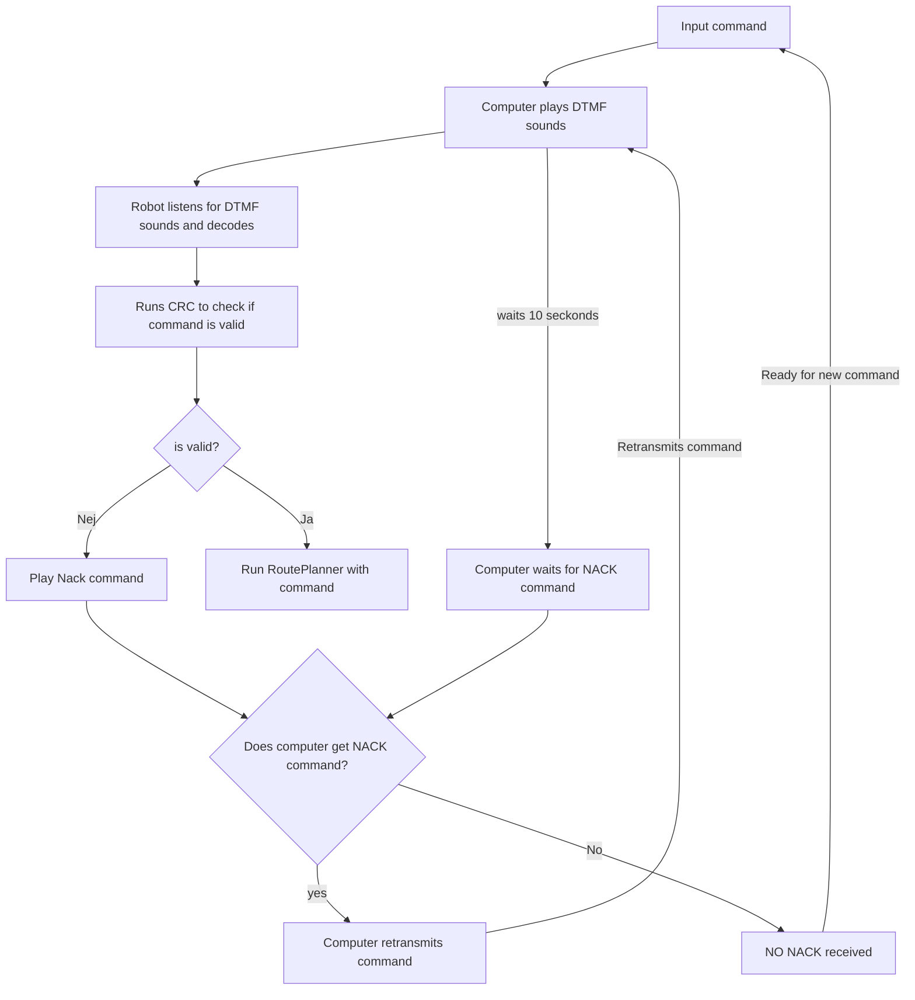

```mermaid
flowchart TD
    A[Input command] --> B[Computer plays DTMF sounds]
    B --> |waits 10 seckonds |C[Computer waits for NACK command]
    B --> D[Robot listens for DTMF sounds and decodes]
    D --> E[Runs CRC to check if command is valid]
    E --> F{is valid?}
    F -->|Ja| G[Run RoutePlanner with command]
    F -->|Nej| H[Play Nack command]
    H --> I{Does computer get NACK command?}
    C --> I
    I --> |yes| K[Computer retransmits command]
    K --> |Retransmits command| B 
    J --> |Ready for new command| A
    I --> |No| J[NO NACK received]    
```