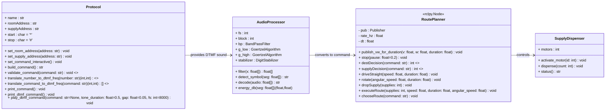

```mermaid
classDiagram
    direction LR

    class RoutePlanner {
        <<rclpy.Node>>
        - pub : Publisher<Twist>
        - rate_hz : float
        - dt : float
        + publish_vw_for_duration(v: float, w: float, duration: float) void
        + stop(pause: float=0.2) void
        + destDecision(command: str) int <<static>>
        + supplyDecision(command: str) int <<static>>
        + driveStraight(speed: float, duration: float) void
        + rotate(angular_speed: float, duration: float) void
        + dropSupply(supplies: int) void
        + executeRoute(supplies: int, speed: float, duration: float, angular_speed: float) void
        + chooseRoute(command: str) void
    }

    class Protocol {
        + name : str
        + roomAddress : str
        + supplyAddress : str
        + start : char = '*'
        + stop  : char = '#'
        + set_room_address(address: str) void
        + set_supply_address(address: str) void
        + set_command_interactive() void
        + build_command() str
        + validate_command(command: str) void <<static>>
        + translate_number_to_dtmf_freq(number: str) (int,int) <<static>>
        + translate_command_to_dtmf_freq(command: str) (int,int)[] <<class>>
        + print_command() void
        + print_dtmf_command() void
        + play_dtmf_command(command: str=None, tone_duration: float=0.5, gap: float=0.05, fs: int=8000) void
    }

    class AudioProcessor {
        + fs : int
        + block : int
        + bp : BandPassFilter
        + g_low : GoertzelAlgorithm
        + g_high : GoertzelAlgorithm
        + stabilizer : DigitStabilizer
        + filter(x: float[]) float[]
        + detect_symbol(seg: float[]) str
        + decode(audio: float[]) str
        + energy_db(seg: float[]) (float,float)
    }

    class SupplyDispenser {
        + motors : int
        + activate_motor(id: int) void
        + dispense(count: int) void
        + status() str
    }

    %% Relations (dataflow)
    Protocol --> AudioProcessor : provides DTMF sound
    AudioProcessor --> RoutePlanner : converts to command
    RoutePlanner --> SupplyDispenser : controls


```