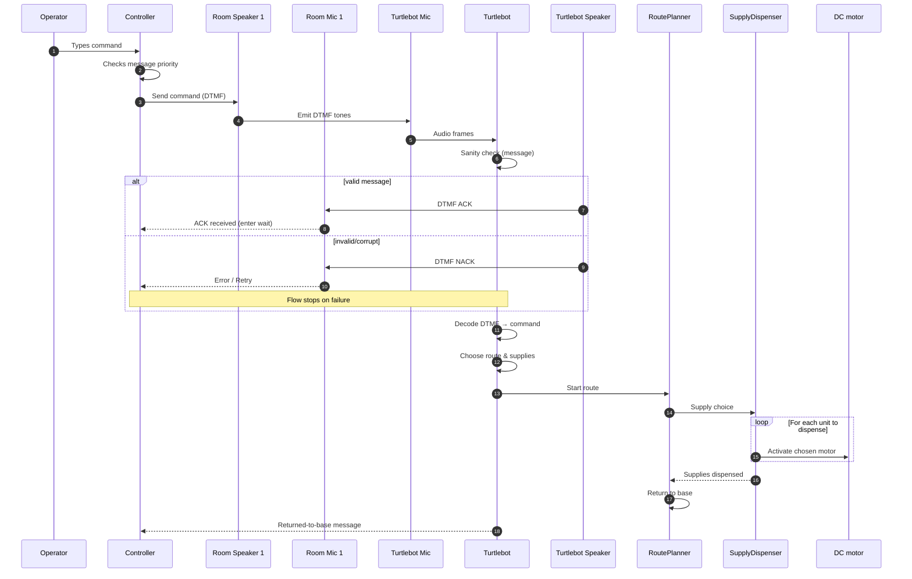

# TurtleBot DTMF Sequence

```mermaid
sequenceDiagram
    autonumber
    participant Operator
    participant Controller
    participant RoomSpeaker1 as Room Speaker 1
    participant RoomMic1 as Room Mic 1
    participant TBMic as Turtlebot Mic
    participant Turtlebot
    participant TBSpeaker as Turtlebot Speaker
    participant RoutePlanner
    participant SupplyDispenser
    participant DCMotor as DC motor

    Operator->>Controller: Types command
    Controller->>Controller: Checks message priority
    Controller->>RoomSpeaker1: Send command (DTMF)
    RoomSpeaker1->>TBMic: Emit DTMF tones
    TBMic->>Turtlebot: Audio frames
    Turtlebot->>Turtlebot: Sanity check (message)

    alt valid message
        TBSpeaker->>RoomMic1: DTMF ACK
        RoomMic1-->>Controller: ACK received (enter wait)
    else invalid/corrupt
        TBSpeaker->>RoomMic1: DTMF NACK
        RoomMic1-->>Controller: Error / Retry
        note over Controller,Turtlebot: Flow stops on failure
    end

    Turtlebot->>Turtlebot: Decode DTMF → command
    Turtlebot->>Turtlebot: Choose route & supplies
    Turtlebot->>RoutePlanner: Start route
    RoutePlanner->>SupplyDispenser: Supply choice
    loop For each unit to dispense
        SupplyDispenser->>DCMotor: Activate chosen motor
    end
    SupplyDispenser-->>RoutePlanner: Supplies dispensed

    RoutePlanner->>RoutePlanner: Return to base
    Turtlebot-->>Controller: Returned-to-base message
```