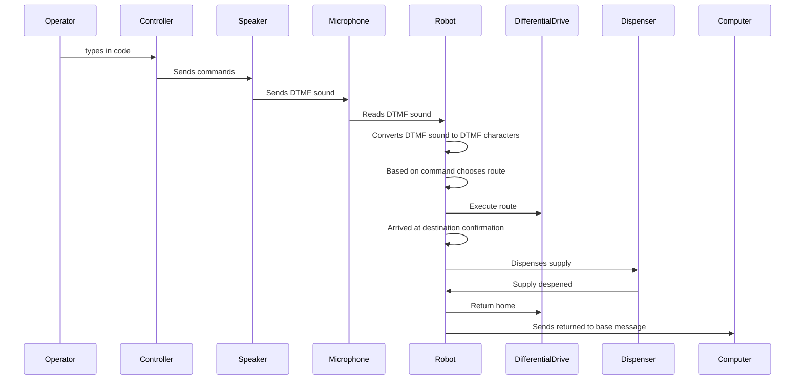

```mermaid
sequenceDiagram
    Operator->>Controller: types in code
    Controller->>Speaker: Sends commands
    Speaker->>Microphone: Sends DTMF sound
    Microphone->>Robot: Reads DTMF sound
    Robot->>Robot: Converts DTMF sound to DTMF characters
    Robot->>Robot: Based on command chooses route
    Robot->>DifferentialDrive: Execute route
    Robot->>Robot: Arrived at destination confirmation
    Robot->>Dispenser: Dispenses supply
    Dispenser->>Robot: Supply despened
    Robot->>DifferentialDrive: Return home
    Robot->>Computer: Sends returned to base message
```